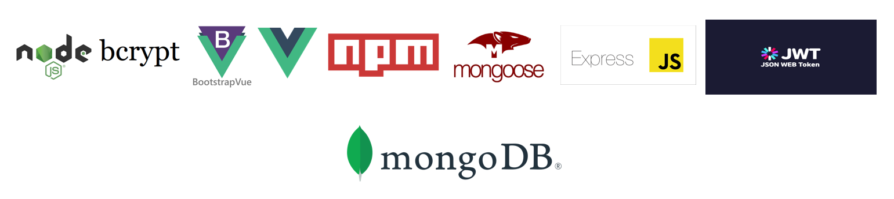
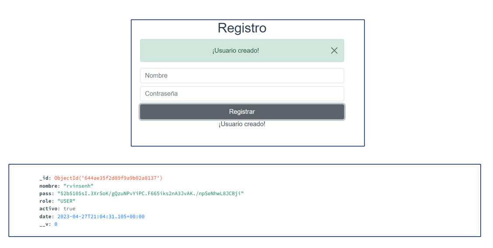
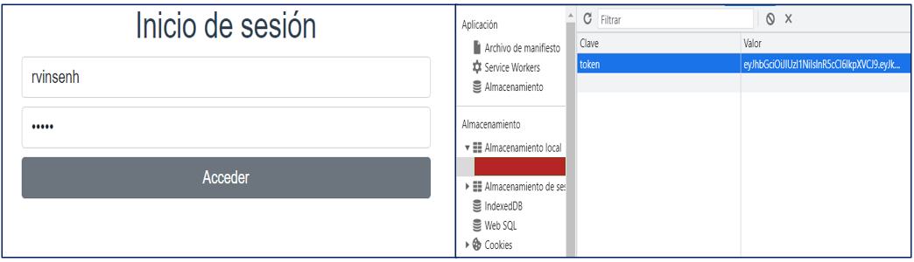
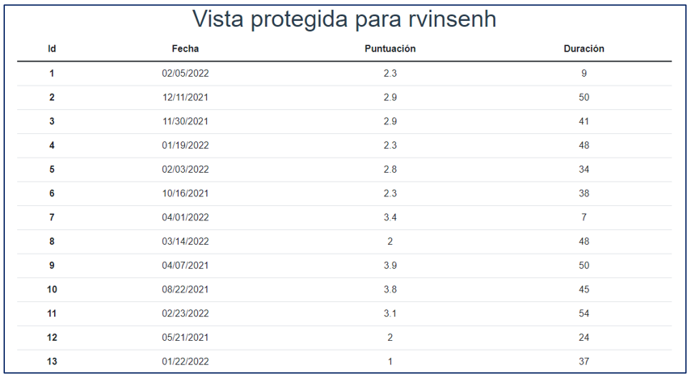
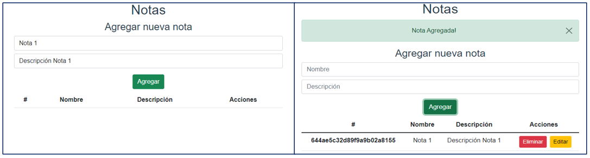
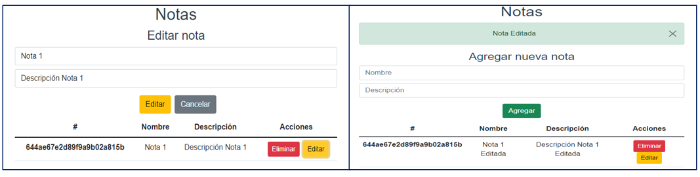
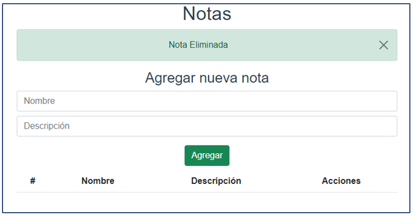
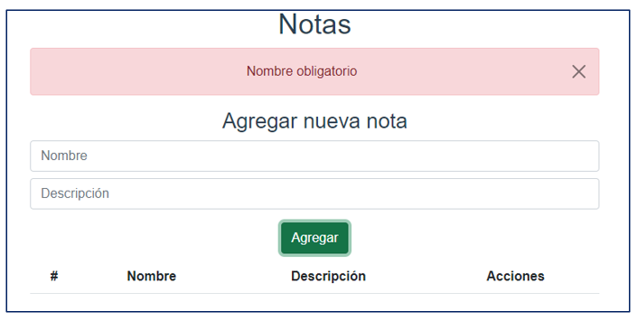

# Proyecto: ```Plataforma web de visualización de notas```

Este proyecto fue desarrollado como requisito para la asignatura ```Desarrollo de Aplicaciones para Internet```, con el fin de aplicar los conocimientos adquiridos durante las clases. El proyecto consistió en crear una plataforma que actuara como intermediario entre un sistema externo y los usuarios registrados en ese sistema, permitiéndoles visualizar sus calificaciones de una manera más sencilla y accesible. Además, para agregar más funcionalidad a la plataforma, se agregaron casos de uso que permiten a los usuarios generar, editar y borrar notas en su perfil personal de la aplicación.  

El proyecto incluye importantes medidas de seguridad, por ejemplo, al registrar una cuenta, la contraseña se encripta en la base de datos MongoDB. Cada vez que un usuario intenta ingresar a su cuenta, se genera un token que le permite navegar por el contenido protegido de la plataforma web. Además, para permitir la creación, edición y eliminación de notas para cada usuario, se estableció una relación entre los modelos ```nota``` y ```user```.

Por otro lado, cuando el usuario inicia sesión y accede a la sección para visualizar los datos del otro sistema, el backend realiza una petición a una API externa utilizando Fetch API, lo que permite mostrar los datos de cada usuario registrado en la base de datos en el frontend.

### Stack de tecnologías.
<p align="center">
  
</p>

#### Las imágenes de la plataforma web se presentarán a continuación y por caso de uso.

## Caso de uso: ```Registrar cuenta```
<p align="center">
  
</p>

#### Como se puede apreciar en la imagen debajo del formulario de registro de cuenta, el sistema encripta la clave proporcionada por el ```Usuario``` y luego la almacena en la base de datos ```MongoDB```.

## Caso de uso: ```Iniciar sesión```
<p align="center">
  
</p>

#### Es importante resaltar que el ```token``` almacenado en el LocalStorage que aparece en la imagen anterior se genera automáticamente cuando el back-end valida los resultados enviados por el usuario en el front-end. Este proceso garantiza la seguridad de la información transmitida y evita posibles vulnerabilidades en el sistema. El ```token``` es una medida de autenticación esencial para acceder a funciones o datos restringidos en el sistema.

## Caso de uso: ```Ver datos```
<p align="center">
  
</p>

#### El objetivo de este caso de uso es establecer una comunicación con una API externa. Por lo tanto, es importante tener en cuenta que la información presentada en la imagen anterior es el resultado de una comunicación entre el back-end y la API externa, así como entre el back-end y el front-end para transmitir los datos obtenidos de la API.

## Caso de uso: ```Agregar nota```
<p align="center">
  
</p>

## Caso de uso: ```Editar nota```
<p align="center">
  
</p>

## Caso de uso: ```Borrar nota```
<p align="center">
  
</p>

#### Por último, es importante mencionar que antes de ingresar una nota, se lleva a cabo una validación de campos. En particular, es obligatorio colocar un nombre a la nota para que pueda ser registrada correctamente en el sistema.

<p align="center">
  
</p>
